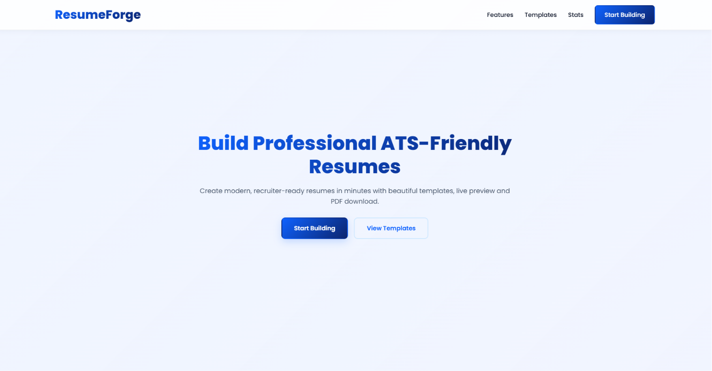
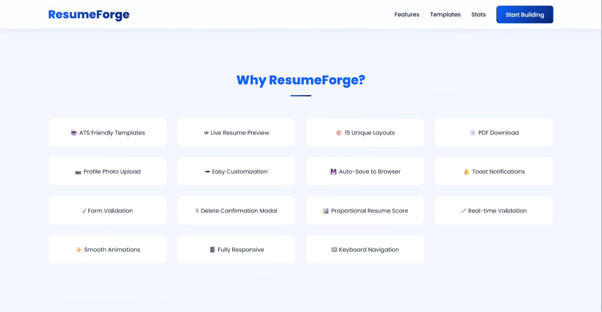
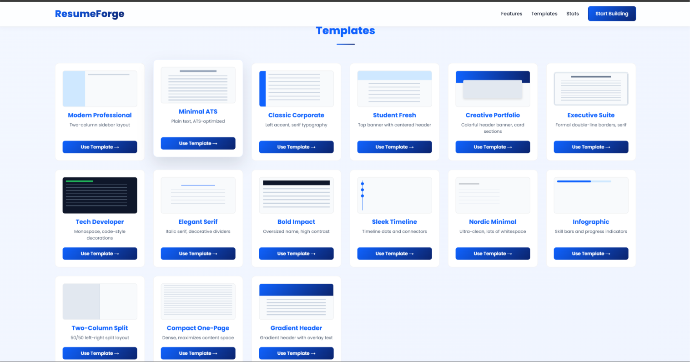
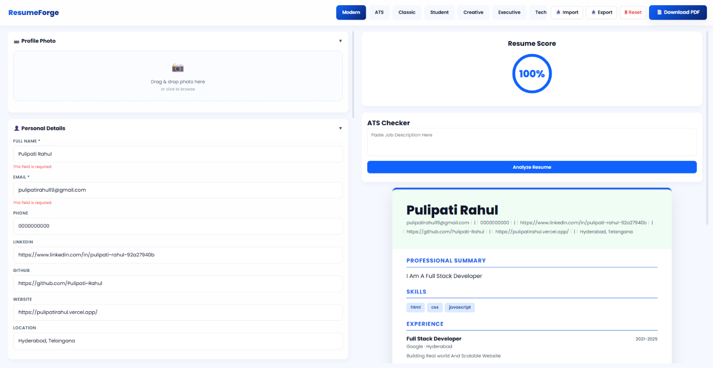
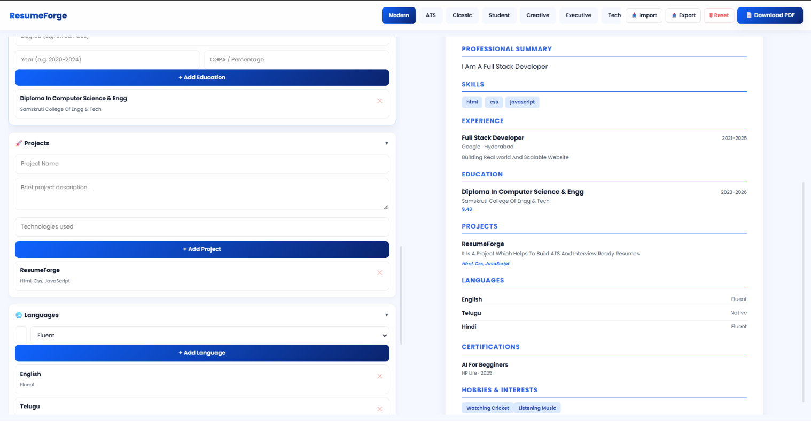
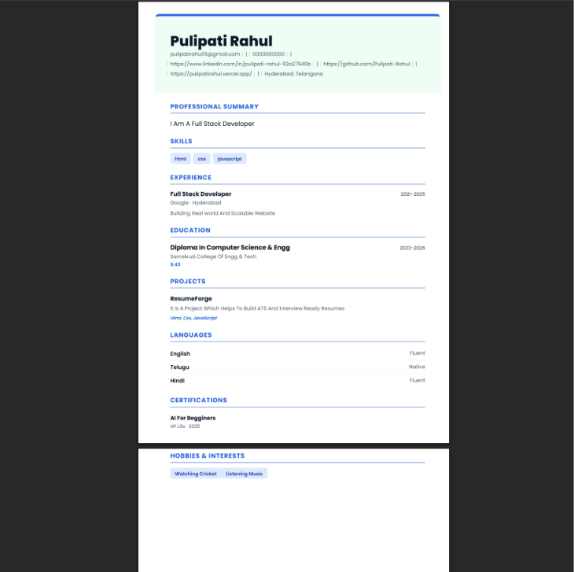
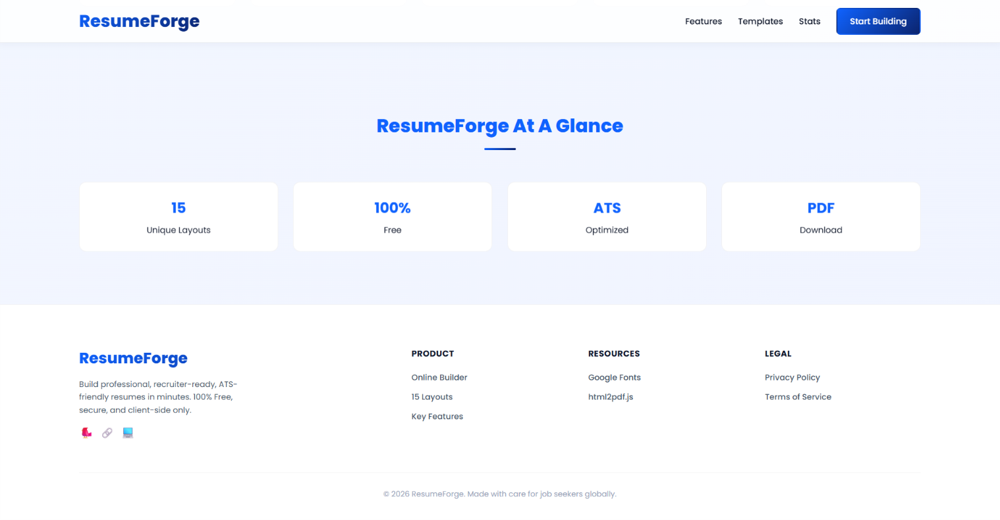
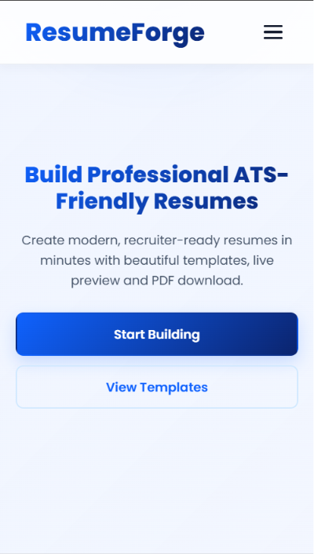

# 📄 ResumeForge

A modern resume builder web application that allows users to create professional resumes with live preview, multiple templates, ATS-friendly scoring, and one-click PDF export.

🔗 **Live Demo:** https://resume-forge19.vercel.app

---

## 📖 About the Project

ResumeForge was built to help students and job seekers create professional resumes quickly without needing complex software.

Users can enter their personal information, education, projects, skills, and work experience while seeing a live preview of their resume. The application includes multiple resume templates, ATS-friendly analysis, resume scoring, local auto-save, and PDF export functionality.

This project helped me strengthen my frontend development skills, DOM manipulation, form validation, browser storage, PDF generation, and responsive UI design.

---

# ✨ Features

### 📄 Resume Builder

- Live resume preview
- Multiple resume sections
- Dynamic form updates
- Professional layouts
- Easy editing

### 🎨 Resume Templates

- 40 resume templates
- Modern UI
- ATS-friendly template
- Template switching
- Professional formatting

### 🤖 ATS Features

- Resume score
- ATS-friendly analysis
- Keyword checker
- Job description matching
- Resume improvement suggestions

### 💾 Productivity

- Auto-save using LocalStorage
- Import JSON resume
- Export JSON resume
- One-click PDF download

### 📱 User Experience

- Responsive design
- Mobile friendly
- Smooth animations
- Form validation
- Loading indicators

---

# 🛠 Tech Stack

## Frontend

- HTML5
- CSS3
- JavaScript (ES6)

## Libraries

- html2pdf.js

## Browser APIs

- LocalStorage
- File API

---

# 📸 Screenshots

## 🏠 Home & Features

<p align="center">
  
  
</p>

## 📄 Template Selection & Live Preview

<p align="center">
  
  
</p>

## 🤖 ATS Analysis & PDF Export

<p align="center">
  
  
</p>

## 📱 Footer & Mobile View

<p align="center">
  
  
</p>

---

# 📂 Project Structure

```text
ResumeForge
│
├── index.html
├── builder.html
│
├── css
│   ├── style.css
│   └── builder.css
│
├── js
│   ├── main.js
│   └── builder.js
│
├── assets
│
└── screenshots
```

---

# ⚙️ Installation

## Clone the repository

```bash
git clone https://github.com/Pulipati-Rahul/resume-forge.git
```

## Navigate into the project

```bash
cd resume-forge
```

## Open the project

Simply open:

```text
index.html
```

in your browser.

No backend or database is required.

---

# ▶️ Running the Project

You can run the project using:

- VS Code Live Server

or

- Open `index.html` directly in your browser.

---

# 🌍 Live Deployment

Frontend

https://resume-forge19.vercel.app

---

# 💡 What I Learned

While building this project, I learned:

- Advanced DOM Manipulation
- Dynamic Form Handling
- LocalStorage Integration
- PDF Generation using html2pdf.js
- Resume Template Switching
- Responsive UI Design
- ATS Resume Optimization
- JavaScript Event Handling
- Client-side Data Management
- Git & GitHub Workflow

---

# 🚀 Future Improvements

- AI-powered resume suggestions
- AI-generated professional summaries
- Drag & Drop section ordering
- Cloud backup
- User authentication
- Resume sharing via link
- More professional templates
- Multi-language support
- Resume analytics

---

# 👨‍💻 Author

**Pulipati Rahul**

Full Stack Developer

GitHub:
https://github.com/Pulipati-Rahul

LinkedIn:
https://www.linkedin.com/in/pulipati-rahul-92a27940b/

---

# ⭐ Support

If you found this project helpful, consider giving it a ⭐ on GitHub.

It motivates me to continue building high-quality projects.
